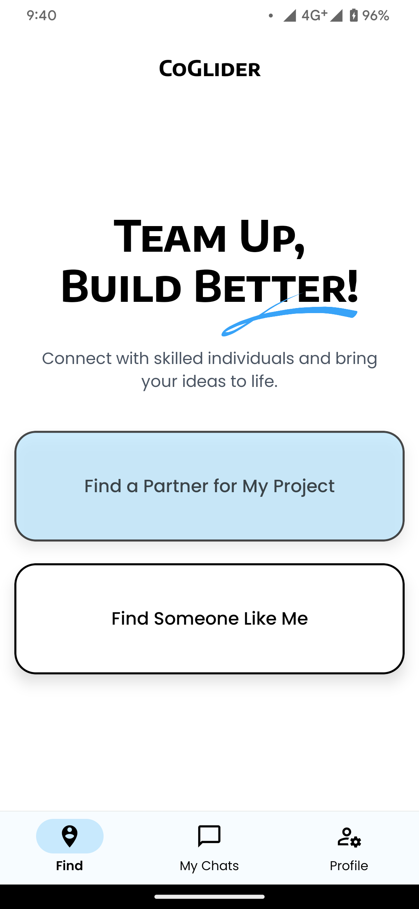

# CoGlider

**CoGlider** is a React Native app designed to connect like-minded individuals by matching them based on skills and proximity. Whether you're looking for a project partner, a mentor, or just someone to collaborate with, CoGlider simplifies the process by providing intelligent recommendations and real-time communication.

## Features

- **User Recommendations**:
  - Discover individuals with similar skills and interests near you.
  - An intuitive Tinder-like interface for browsing through potential collaborators.
  - Intelligent sorting to prioritize users closest to your location.

- **Real-Time Messaging**:
  - Engage in one-on-one chats with your matches.
  - Real-time updates powered by Firebase Firestore.
  - Receive instant push notifications for new messages using Expo Notifications.

- **Profile Management**:
  - Create and edit your personalized profile.
  - Update your skills, preferences, and profile picture anytime.

- **Search Functionality**:
  - Quickly find users or collaborators based on their names or skills.

- **Responsive Design**:
  - A seamless and adaptive user experience optimized for both Android and iOS platforms.

## Tech Stack

- **Frontend**:
  - React Native (Expo)
  - NativeWind (Tailwind CSS for React native)

- **Backend**:
  - Firebase Firestore for database and real-time updates
  - Firebase Authentication for secure user login and registration

- **Additional Tools**:
  - Cloudinary for image uploads and management
  - Google Places API for location search and geocoding
  - Expo Notifications for push notification management

## Screenshots

|  |  |  |
|------------------------------------------------------|------------------------------------------------------|------------------------------------------------------|
|  |  |  |
|------------------------------------------------------|------------------------------------------------------|------------------------------------------------------|
|  |  |  |

## Roadmap

- Add group chat functionality to enable collaborative discussions.
- Implement AI-powered recommendations for more accurate matches.
- Integrate location-based notifications for real-time updates.
- Expand skill categories to cater to a broader audience.

## Contributing

Contributions are welcome! Please fork the repository and submit a pull request.

## License

This project is licensed under the MIT License. See the [LICENSE](LICENSE) file for details.

## Acknowledgments

- [Expo](https://expo.dev/)
- [Firebase](https://firebase.google.com/)
- [Cloudinary](https://cloudinary.com/)
- [Google Places API](https://developers.google.com/maps/documentation/places/web-service/overview)

---

Feel free to star the repository and follow for updates!
